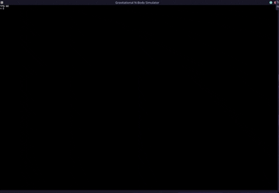
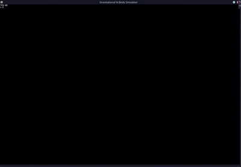
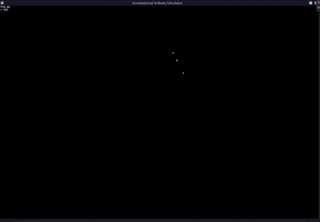

# N-Body Gravitational Particle Simulator

Real-time 2D Newtonian N-body simulation in C with [raylib](https://www.raylib.com/). Additive blending for cluster glow, color shifts with velocity.

## Demos

<strong>Galaxy collision merge</strong>

  

  

<strong>Point-like mass cluster</strong>

  

## Simulator Settings

**`PARTICLE_MASS`** (`2500.0f`) — How heavy each particle is. Higher mass = stronger pull, faster clumping.

**`GRAVITATIONAL_CONSTANT`** (`1.5f`) — Overall gravity strength. Higher = faster motion. `0` disables gravity.

**`SOFTENING_FACTOR`** (`100.0f`) — Added to distance² so gravity stays finite when particles overlap. Prevents off-screen launches.

**`PARTICLES_PER_CLICK`** (`125`) — Particles spawned per frame while holding the mouse button.

**`SPREAD_X`** (`18`) **& `SPREAD_Y`** (`5`) — Random spawn offset around the cursor. Wider X than Y gives a flat, galaxy-like disk.

## Controls

- **Hold left mouse** — spawn particles at cursor
- **Close window** — exit

Requires [raylib](https://github.com/raysan5/raylib).